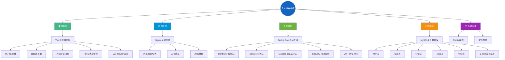

# 系统总体架构图

```mermaid
graph TD
    Root((个人博客系统)) --> Frontend["🖥️ 前端层"]
    Root --> Gateway["🌐 网关层"]
    Root --> Backend["⚙️ 后端层"]
    Root --> Data["💾 数据层"]
    Root --> Infra["📦 基础设施"]
    
    Frontend --> FE1["Vue 3 前端应用"]
    FE1 --> FE1a["用户端页面"]
    FE1 --> FE1b["管理端页面"]
    FE1 --> FE1c["Axios 请求库"]
    FE1 --> FE1d["Pinia 状态管理"]
    FE1 --> FE1e["Vue Router 路由"]
    
    Gateway --> GW1["Nginx 反向代理"]
    GW1 --> GW1a["静态资源服务"]
    GW1 --> GW1b["API 转发"]
    GW1 --> GW1c["跨域处理"]
    
    Backend --> BE1["Spring Boot 3.x 应用"]
    BE1 --> BE1a["Controller 控制层"]
    BE1 --> BE1b["Service 业务层"]
    BE1 --> BE1c["Mapper 数据访问层"]
    BE1 --> BE1d["Security 权限控制"]
    BE1 --> BE1e["JWT 认证授权"]
    
    Data --> DB1["MySQL 8.0 数据库"]
    DB1 --> DB1a["用户表"]
    DB1 --> DB1b["文章表"]
    DB1 --> DB1c["分类表"]
    DB1 --> DB1d["标签表"]
    DB1 --> DB1e["评论表"]
    DB1 --> DB1f["文章标签关联表"]
    
    Infra --> INF1["Redis 缓存"]
    Infra --> INF2["文件存储"]
    
    style Root fill:#1565c0,color:#fff
    style Frontend fill:#42b883,color:#fff
    style Gateway fill:#0096d6,color:#fff
    style Backend fill:#6db33f,color:#fff
    style Data fill:#f29111,color:#fff
    style Infra fill:#9c27b0,color:#fff
```
