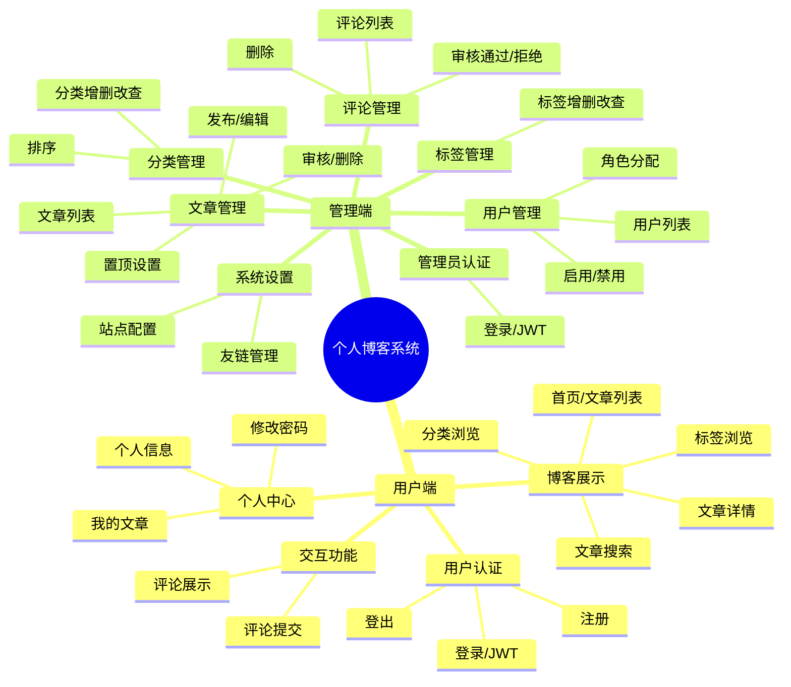

# 系统功能模块图

```mermaid
mindmap
  root((个人博客系统))
    用户端
      用户认证
        注册
        登录/JWT
        登出
      博客展示
        首页/文章列表
        文章详情
        分类浏览
        标签浏览
        文章搜索
      交互功能
        评论提交
        评论展示
      个人中心
        个人信息
        我的文章
        修改密码
    管理端
      管理员认证
        登录/JWT
      用户管理
        用户列表
        启用/禁用
        角色分配
      文章管理
        文章列表
        发布/编辑
        审核/删除
        置顶设置
      分类管理
        分类增删改查
        排序
      标签管理
        标签增删改查
      评论管理
        评论列表
        审核通过/拒绝
        删除
      系统设置
        站点配置
        友链管理
```
