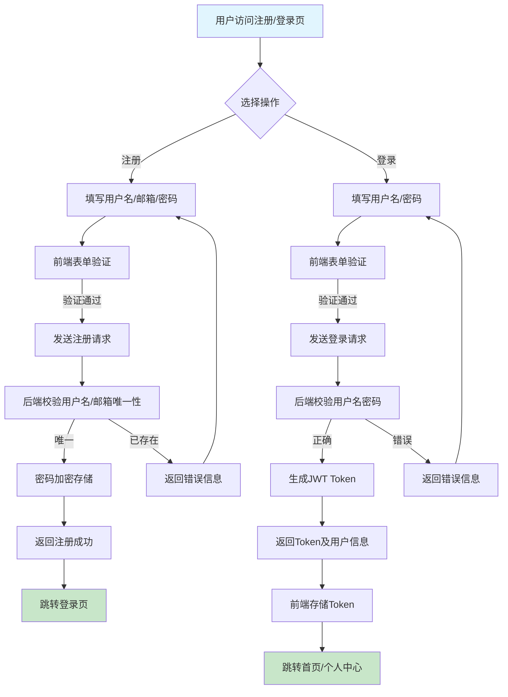

# 用户注册登录流程

```mermaid
flowchart TD
    A[用户访问注册/登录页] --> B{选择操作}
    B -->|注册| C[填写用户名/邮箱/密码]
    C --> D[前端表单验证]
    D -->|验证通过| E[发送注册请求]
    E --> F[后端校验用户名/邮箱唯一性]
    F -->|唯一| G[密码加密存储]
    G --> H[返回注册成功]
    H --> I[跳转登录页]
    F -->|已存在| J[返回错误信息]
    J --> C
    
    B -->|登录| K[填写用户名/密码]
    K --> L[前端表单验证]
    L -->|验证通过| M[发送登录请求]
    M --> N[后端校验用户名密码]
    N -->|正确| O[生成JWT Token]
    O --> P[返回Token及用户信息]
    P --> Q[前端存储Token]
    Q --> R[跳转首页/个人中心]
    N -->|错误| S[返回错误信息]
    S --> K
    
    style A fill:#e1f5fe
    style R fill:#c8e6c9
    style I fill:#c8e6c9
```
