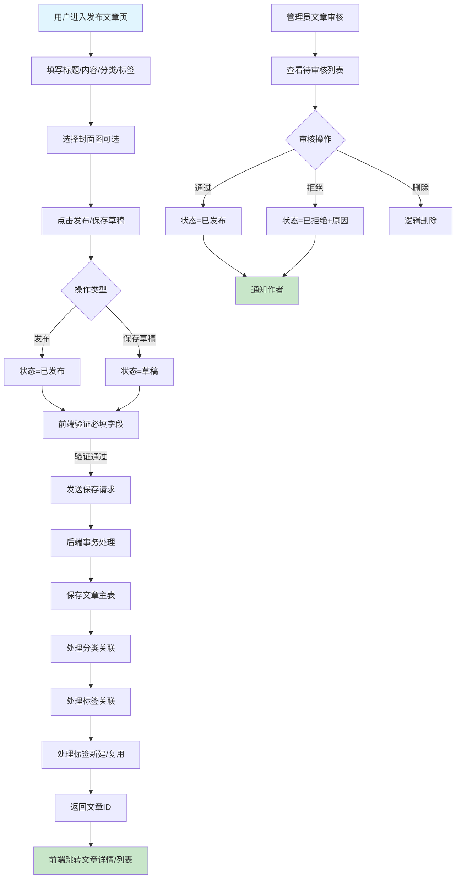

# 文章发布管理流程

```mermaid
flowchart TD
    A[用户进入发布文章页] --> B[填写标题/内容/分类/标签]
    B --> C[选择封面图可选]
    C --> D[点击发布/保存草稿]
    D --> E{操作类型}
    E -->|发布| F[状态=已发布]
    E -->|保存草稿| G[状态=草稿]
    F --> H[前端验证必填字段]
    G --> H
    H -->|验证通过| I[发送保存请求]
    I --> J[后端事务处理]
    J --> K[保存文章主表]
    K --> L[处理分类关联]
    L --> M[处理标签关联]
    M --> N[处理标签新建/复用]
    N --> O[返回文章ID]
    O --> P[前端跳转文章详情/列表]
    
    Q[管理员文章审核] --> R[查看待审核列表]
    R --> S{审核操作}
    S -->|通过| T[状态=已发布]
    S -->|拒绝| U[状态=已拒绝+原因]
    S -->|删除| V[逻辑删除]
    T --> W[通知作者]
    U --> W
    
    style A fill:#e1f5fe
    style P fill:#c8e6c9
    style W fill:#c8e6c9
```
