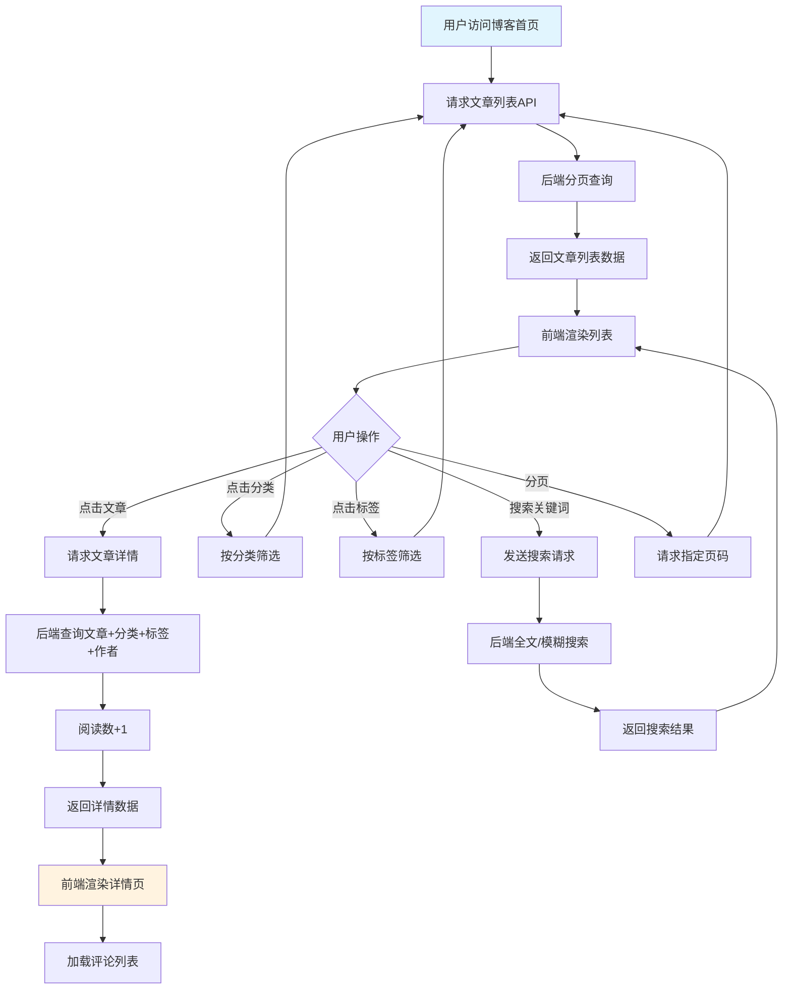

# 文章浏览搜索流程

```mermaid
flowchart TD
    A[用户访问博客首页] --> B[请求文章列表API]
    B --> C[后端分页查询]
    C --> D[返回文章列表数据]
    D --> E[前端渲染列表]
    E --> F{用户操作}
    
    F -->|点击文章| G[请求文章详情]
    G --> H[后端查询文章+分类+标签+作者]
    H --> I[阅读数+1]
    I --> J[返回详情数据]
    J --> K[前端渲染详情页]
    K --> L[加载评论列表]
    
    F -->|点击分类| M[按分类筛选]
    M --> B
    
    F -->|点击标签| N[按标签筛选]
    N --> B
    
    F -->|搜索关键词| O[发送搜索请求]
    O --> P[后端全文/模糊搜索]
    P --> Q[返回搜索结果]
    Q --> E
    
    F -->|分页| R[请求指定页码]
    R --> B
    
    style A fill:#e1f5fe
    style K fill:#fff3e0
```
