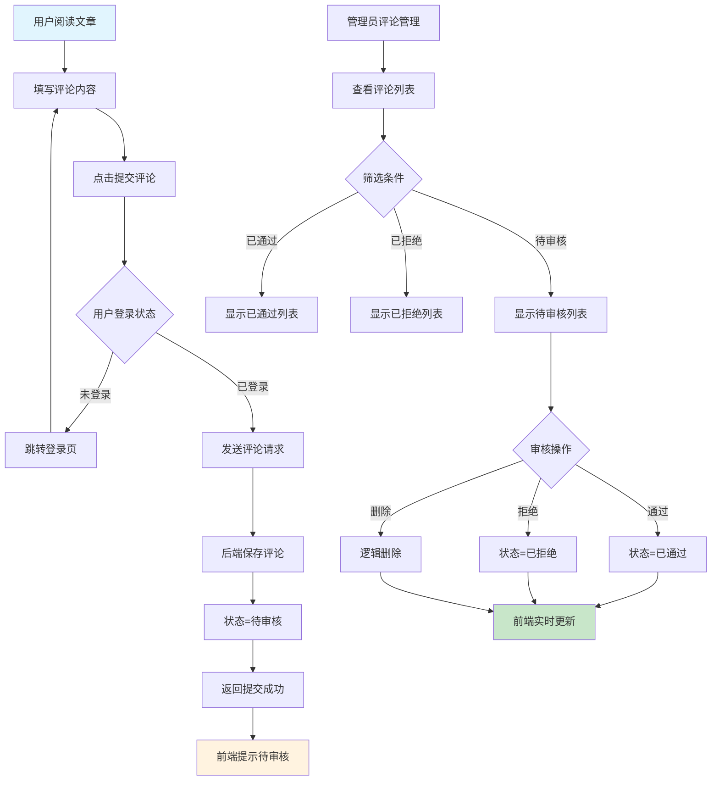

# 评论提交审核流程

```mermaid
flowchart TD
    A[用户阅读文章] --> B[填写评论内容]
    B --> C[点击提交评论]
    C --> D{用户登录状态}
    D -->|未登录| E[跳转登录页]
    E --> B
    D -->|已登录| F[发送评论请求]
    F --> G[后端保存评论]
    G --> H[状态=待审核]
    H --> I[返回提交成功]
    I --> J[前端提示待审核]
    
    K[管理员评论管理] --> L[查看评论列表]
    L --> M{筛选条件}
    M -->|待审核| N[显示待审核列表]
    M -->|已通过| O[显示已通过列表]
    M -->|已拒绝| P[显示已拒绝列表]
    
    N --> Q{审核操作}
    Q -->|通过| R[状态=已通过]
    Q -->|拒绝| S[状态=已拒绝]
    Q -->|删除| T[逻辑删除]
    R --> U[前端实时更新]
    S --> U
    T --> U
    
    style A fill:#e1f5fe
    style J fill:#fff3e0
    style U fill:#c8e6c9
```
