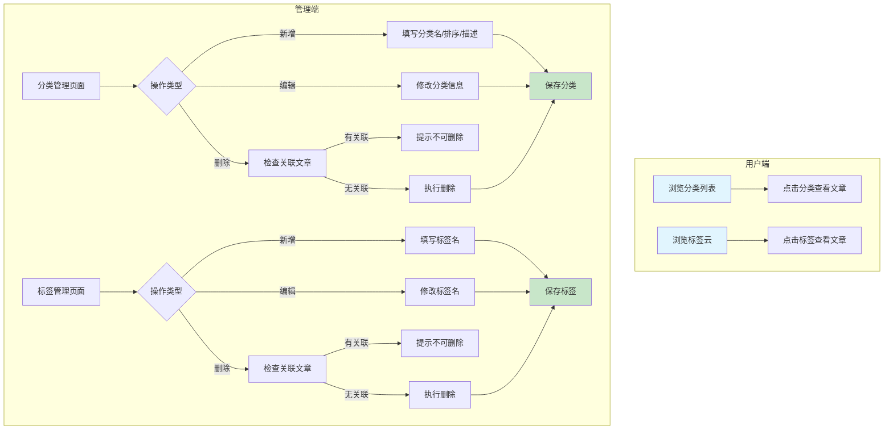

# 分类标签管理流程

```mermaid
flowchart TD
    subgraph 用户端
        A1[浏览分类列表] --> B1[点击分类查看文章]
        A2[浏览标签云] --> B2[点击标签查看文章]
    end
    
    subgraph 管理端
        C1[分类管理页面] --> D1{操作类型}
        D1 -->|新增| E1[填写分类名/排序/描述]
        D1 -->|编辑| F1[修改分类信息]
        D1 -->|删除| G1[检查关联文章]
        G1 -->|有关联| H1[提示不可删除]
        G1 -->|无关联| I1[执行删除]
        E1 --> J1[保存分类]
        F1 --> J1
        I1 --> J1
        
        C2[标签管理页面] --> D2{操作类型}
        D2 -->|新增| E2[填写标签名]
        D2 -->|编辑| F2[修改标签名]
        D2 -->|删除| G2[检查关联文章]
        G2 -->|有关联| H2[提示不可删除]
        G2 -->|无关联| I2[执行删除]
        E2 --> J2[保存标签]
        F2 --> J2
        I2 --> J2
    end
    
    style A1 fill:#e1f5fe
    style A2 fill:#e1f5fe
    style J1 fill:#c8e6c9
    style J2 fill:#c8e6c9
```
