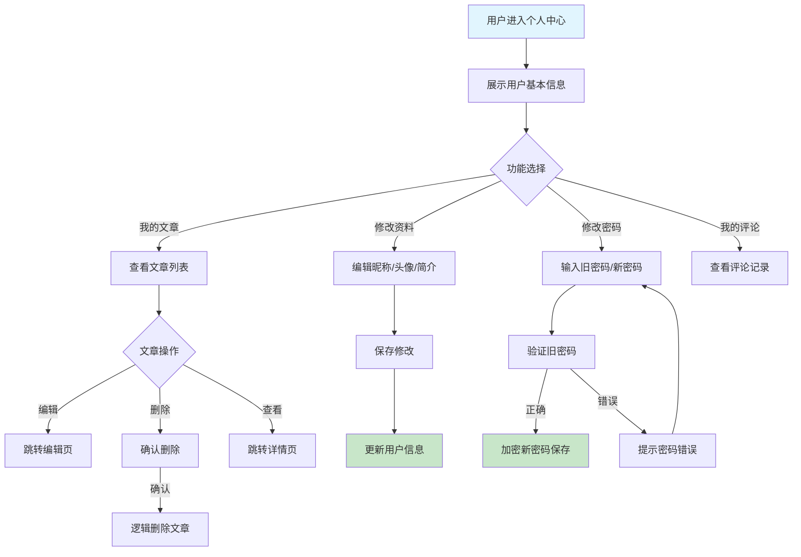

# 个人中心管理流程

```mermaid
flowchart TD
    A[用户进入个人中心] --> B[展示用户基本信息]
    B --> C{功能选择}
    
    C -->|我的文章| D[查看文章列表]
    D --> E{文章操作}
    E -->|编辑| F[跳转编辑页]
    E -->|删除| G[确认删除]
    G -->|确认| H[逻辑删除文章]
    E -->|查看| I[跳转详情页]
    
    C -->|修改资料| J[编辑昵称/头像/简介]
    J --> K[保存修改]
    K --> L[更新用户信息]
    
    C -->|修改密码| M[输入旧密码/新密码]
    M --> N[验证旧密码]
    N -->|正确| O[加密新密码保存]
    N -->|错误| P[提示密码错误]
    P --> M
    
    C -->|我的评论| Q[查看评论记录]
    
    style A fill:#e1f5fe
    style L fill:#c8e6c9
    style O fill:#c8e6c9
```
