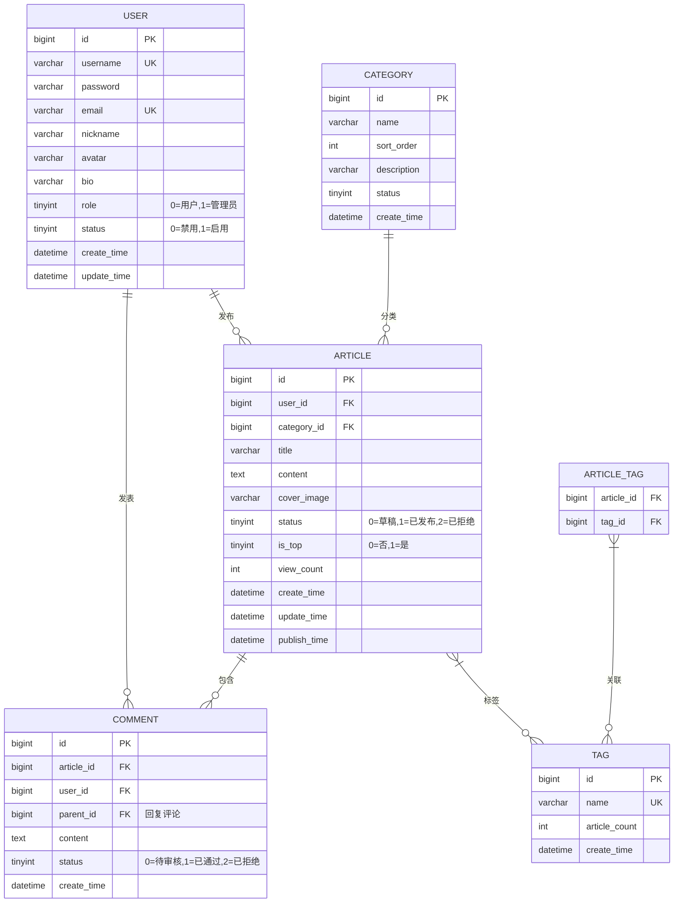

# 数据库ER图

```mermaid
erDiagram
    USER ||--o{ ARTICLE : "发布"
    USER ||--o{ COMMENT : "发表"
    ARTICLE ||--o{ COMMENT : "包含"
    CATEGORY ||--o{ ARTICLE : "分类"
    ARTICLE }|--o{ TAG : "标签"
    ARTICLE_TAG }|--o{ TAG : "关联"
    
    USER {
        bigint id PK
        varchar username UK
        varchar password
        varchar email UK
        varchar nickname
        varchar avatar
        varchar bio
        tinyint role "0=用户,1=管理员"
        tinyint status "0=禁用,1=启用"
        datetime create_time
        datetime update_time
    }
    
    ARTICLE {
        bigint id PK
        bigint user_id FK
        bigint category_id FK
        varchar title
        text content
        varchar cover_image
        tinyint status "0=草稿,1=已发布,2=已拒绝"
        tinyint is_top "0=否,1=是"
        int view_count
        datetime create_time
        datetime update_time
        datetime publish_time
    }
    
    CATEGORY {
        bigint id PK
        varchar name
        int sort_order
        varchar description
        tinyint status
        datetime create_time
    }
    
    TAG {
        bigint id PK
        varchar name UK
        int article_count
        datetime create_time
    }
    
    COMMENT {
        bigint id PK
        bigint article_id FK
        bigint user_id FK
        bigint parent_id FK "回复评论"
        text content
        tinyint status "0=待审核,1=已通过,2=已拒绝"
        datetime create_time
    }
    
    ARTICLE_TAG {
        bigint article_id FK
        bigint tag_id FK
    }
```
