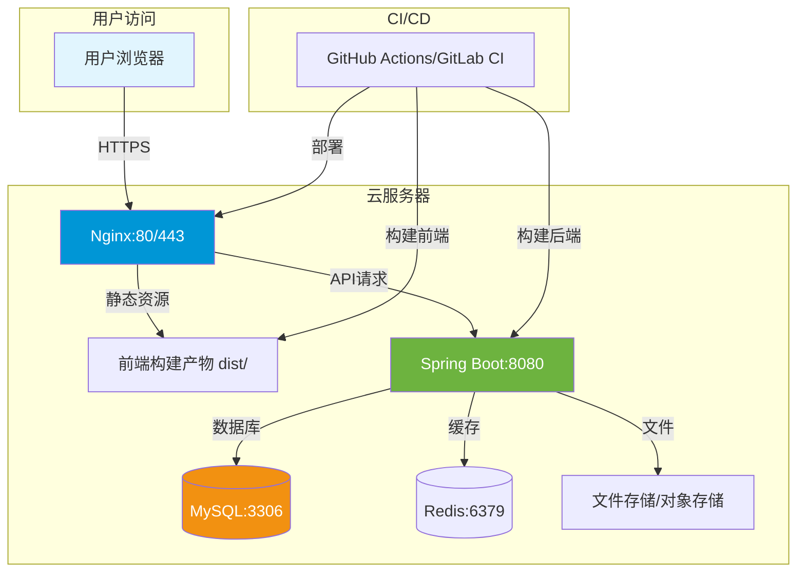

# 系统部署拓扑图

```mermaid
graph TB
    subgraph "用户访问"
        U[用户浏览器]
    end
    
    subgraph "云服务器"
        direction TB
        N[Nginx:80/443]
        N -->|静态资源| S[前端构建产物 dist/]
        N -->|API请求| B[Spring Boot:8080]
        B -->|数据库| DB[(MySQL:3306)]
        B -->|缓存| R[(Redis:6379)]
        B -->|文件| FS[文件存储/对象存储]
    end
    
    U -->|HTTPS| N
    
    subgraph "CI/CD"
        CI[GitHub Actions/GitLab CI]
        CI -->|构建前端| S
        CI -->|构建后端| B
        CI -->|部署| N
    end
    
    style U fill:#e1f5fe
    style N fill:#0096d6,color:#fff
    style B fill:#6db33f,color:#fff
    style DB fill:#f29111,color:#fff
```
