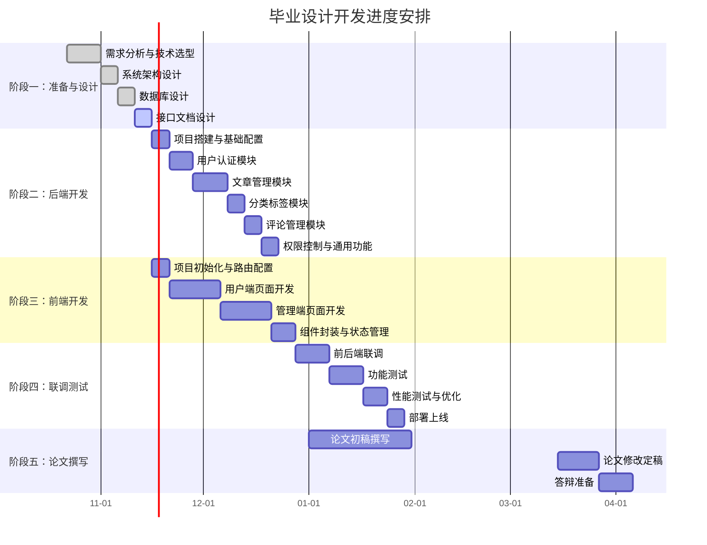

# 开发进度甘特图

```mermaid
gantt
    title 毕业设计开发进度安排
    dateFormat  YYYY-MM-DD
    axisFormat  %m-%d
    
    section 阶段一：准备与设计
    需求分析与技术选型     :done, des1, 2026-10-22, 10d
    系统架构设计           :done, des2, 2026-11-01, 5d
    数据库设计             :done, des3, 2026-11-06, 5d
    接口文档设计           :active, des4, 2026-11-11, 5d
    
    section 阶段二：后端开发
    项目搭建与基础配置     :backend1, 2026-11-16, 5d
    用户认证模块           :backend2, 2026-11-21, 7d
    文章管理模块           :backend3, 2026-11-28, 10d
    分类标签模块           :backend4, 2026-12-08, 5d
    评论管理模块           :backend5, 2026-12-13, 5d
    权限控制与通用功能     :backend6, 2026-12-18, 5d
    
    section 阶段三：前端开发
    项目初始化与路由配置   :frontend1, 2026-11-16, 5d
    用户端页面开发         :frontend2, 2026-11-21, 15d
    管理端页面开发         :frontend3, 2026-12-06, 15d
    组件封装与状态管理     :frontend4, 2026-12-21, 7d
    
    section 阶段四：联调测试
    前后端联调             :test1, 2026-12-28, 10d
    功能测试               :test2, 2027-01-07, 10d
    性能测试与优化         :test3, 2027-01-17, 7d
    部署上线               :test4, 2027-01-24, 5d
    
    section 阶段五：论文撰写
    论文初稿撰写           :paper1, 2027-01-01, 30d
    论文修改定稿           :paper2, 2027-03-15, 12d
    答辩准备               :paper3, 2027-03-27, 10d
```
